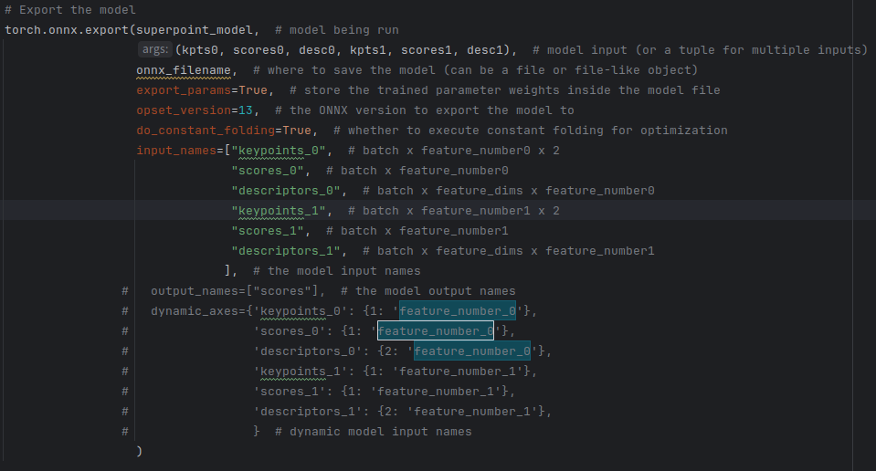
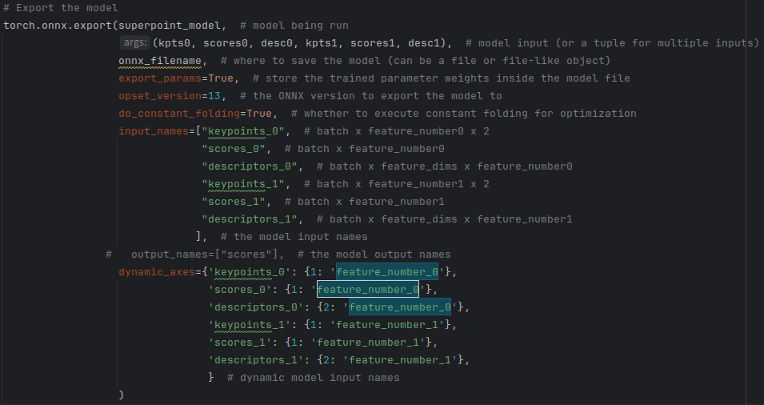

## 1、模型转换
### superpoint_v1.pth转superpoint_v1.onnx
    转成动态分辨率的onnx,后面转om时指定输入图像分辨率大小就行(也可以关闭convert_superpoint_to_onnx.py中的动态分辨率开关，转成静态)
    执行convert_superpoint_to_onnx.py

### superpoint_v1.onnx转superpoint.om（如果onnx是动态，--input_shape要指定）

    atc --model=superpoint_v1.onnx --framework=5 --output=superpoint --input_shape="input:1,1,480,320"  --soc_version=Ascend310
    --input_shape根据输入的节点名字和分辨率进行修改

### superglue_outdoor.pth转superglue_outdoor.onnx
注意：superglue.py里面要指定superpoint的输入归一化，否则结果不对

    kpts0 = normalize_keypoints(kpts0, [1080, 1920])   # 大小为superpoint输入的大小
    kpts1 = normalize_keypoints(kpts1, [1080, 1920])
    
    执行convert_superglue_to_onnx.py

两种方式：
- 一种指定输入维度，即指定特征点个数，转onnx时不转出动态分辨率（关闭动态分辨率开关）

再转静态的om:

    
    atc --model=superglue_outdoor_end2end.onnx --framework=5 --output=superglue_outdoor_end2end --soc_version=Ascend310

- 一种不指定输入维度（打开动态分辨率开关），转onnx时设置维度，有两种转换方式：

1、设置输入特征点个数的大小，如512个点：

    atc --model=superglue_outdoor.onnx --framework=5 --output=superglue --input_shape="keypoints_0:1,512,2;scores_0:1,512;descriptors_0:1,256,512;keypoints_1:1,512,2;scores_1:1,512;descriptors_1:1,256,512"  --soc_version=Ascend310

2、动态特征点个数设置，利用ascend中的动态维度(ND)，特征点个数可以自适应：

    atc --model=superglue_outdoor_dynamic.onnx --framework=5 --output=superglue_outdoor_dynamic --soc_version=Ascend310 --input_shape="keypoints_0:1,-1,2;scores_0:1,-1;descriptors_0:1,256,-1;keypoints_1:1,-1,2;scores_1:1,-1;descriptors_1:1,256,-1" --dynamic_dims="512,512,512,512,512,512;1024,1024,1024,1024,1024,1024" --input_format=ND

## 2、程序运行

    mkdir build && cd build && cmake .. && make
    ./super_demo
